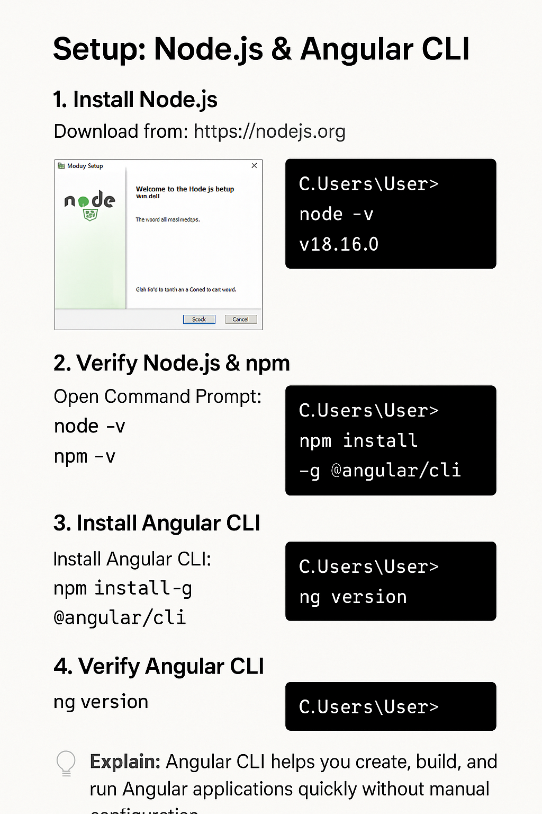

# Setup: Node.js & Angular CLI

## 🎯 Goal

Step-by-step instructions to install **Node.js (with npm)** and **Angular CLI** so students can create, build, and run Angular applications.

---

## Quick checklist (what you'll run)

```bash
node -v
npm -v
npm install -g @angular/cli
ng version
```

---

## Recommended Node.js version

Use a **current LTS** release of Node.js (LTS is stable and recommended for production / learning). If you want multiple Node versions or easy switching, use **nvm (Node Version Manager)** — instructions below.

---

## Install Node.js

### Windows

1. Download the Windows installer from the official Node.js [website](https://nodejs.org/en/download) and run it (choose the LTS installer).
2. Follow the installer steps (keep default options). Ensure "Add to PATH" is checked.
3. Open PowerShell or Command Prompt and verify:

```bash
   node -v
   npm -v
```



---

## Install Angular CLI

**Globally install Angular CLI** so you can use `ng` from the terminal.

```bash
npm install -g @angular/cli
```

**Verify Angular CLI**

```bash
   ng version
   # or
   ng v
```

The command shows Angular CLI version, Node version, and installed packages.  
You can also check the belo path to see the angular module installed:

      C:\Users\<YourUserName>\AppData\Roaming\npm\node_modules

---

## Create & run a project (quick test)

```bash
ng new hello-angular
cd hello-angular
ng serve --open
```

`--open` launches the browser automatically; default URL: `http://localhost:4200`.

If `ng serve` fails with a port issue, use:

```bash
ng serve --port 4300 --open
```

---

## Common installation issues & fixes

### "ng: command not found" after install

* Restart your terminal so PATH updates apply.
* Ensure the global npm bin directory is in PATH. Example check:

```bash
  npm bin -g
  # add that path to PATH if missing
```

### Proxy / Corporate Network

* If behind a proxy, configure npm:

```bash
npm config set proxy http://proxy.company.com:8080
npm config set https-proxy http://proxy.company.com:8080
```

### "ng serve" shows blank page or build errors

* Check the console output for specific errors.
* Run `ng build` to see build-time errors.
* If port already in use, change port with `--port`.

---

## Updating / Uninstalling Angular CLI

Update to latest CLI globally:

```bash
npm install -g @angular/cli@latest
```

Uninstall then reinstall (if corrupt):

```bash
npm uninstall -g @angular/cli
npm cache clean --force
npm install -g @angular/cli
```

---

## Notes for Windows users

* Use PowerShell or Windows Terminal (recommended) rather than the old cmd.exe.
* If using WSL (Windows Subsystem for Linux), install Node and Angular CLI inside WSL and use its terminal.

---

## Quick troubleshooting checklist

* `node -v` and `npm -v` return versions.
* `ng version` returns Angular CLI version.
* PATH includes npm global bin.
* If installation fails, try using nvm.

---

## Helpful commands summary

```bash
# verify
node -v
npm -v
ng version

# create project
ng new my-app
cd my-app
ng serve --open

# update CLI
npm install -g @angular/cli@latest
```

---
